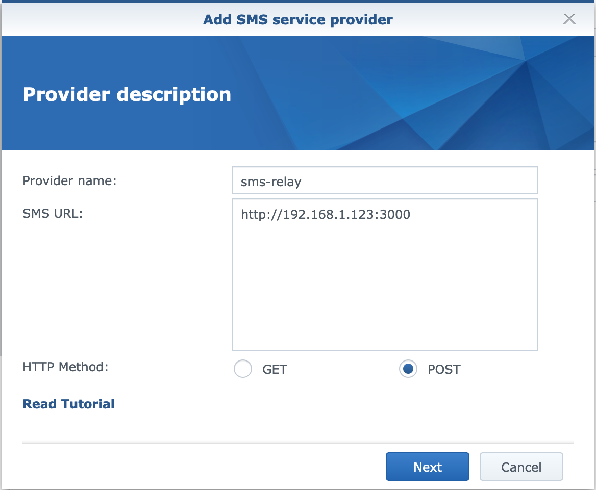
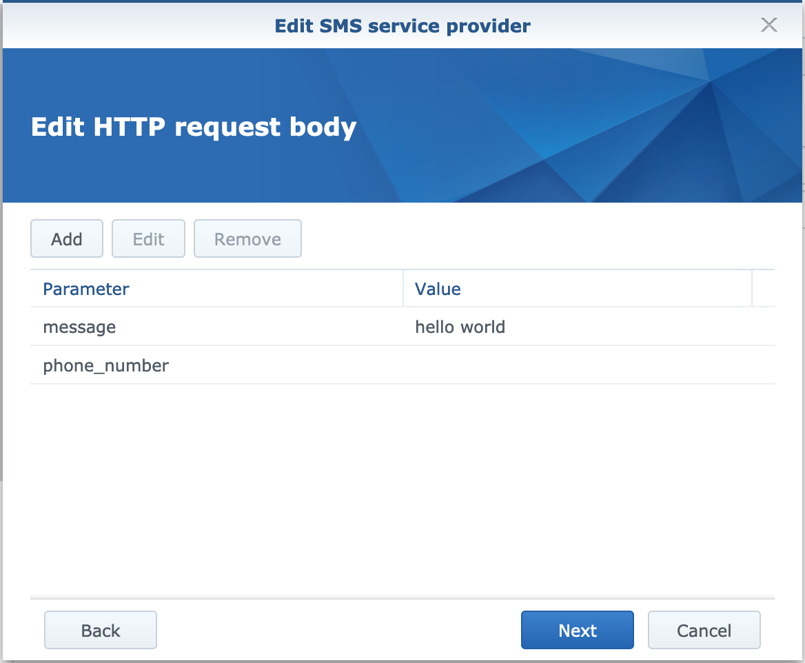
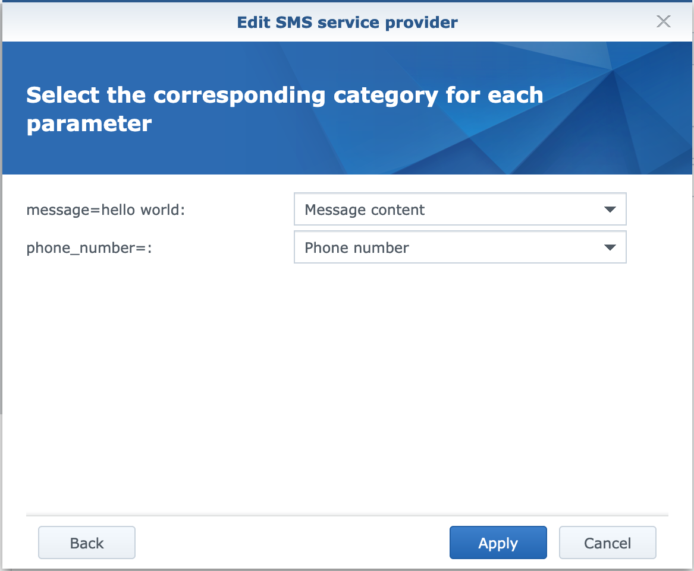

# synology sms relay

This is a simple nodejs server which acts as an SMS relay for Synology DSM SMS notifications.
When it receives notification requests, it runs a custom shell or nodejs script, passing the notification message to it.

# The Why
Inspiration was drawn from the fantastic [synology-notifications](https://github.com/ryancurrah/synology-notifications) project. I used it for a while with great success, but I have now moved away from Slack to pushover (as it suits my needs better) and needed a way to relay the notifications from Synology to pushover. Pushover offers a way for me to send an email to my account's address which will get converted to a notification, but it shows up as "Email gateway" with an envelope icon, so my OCD suffered immensely :smile:, until I decided to create this.
It allows me to create an app (in Pushover) with any icon, and - using a script - customize the notification as much as I want.

# The How
The deployment of this app is very simple (assuming you're familiar with Docker and have it up and running). The setup in Synology's DSM is, also simple, but to make it easy for you, here it is:

## docker-compose

1. Create a `docker-compose.yml` somewhere and paste this:
```yml
---
version: '3.7'
services:
  synology-sms-relay:
    container_name: synology-sms-relay
    image: tborychowski/synology-sms-relay
    restart: unless-stopped
    ports:
      - "3000:3000"
    volumes:
      - ./script.sh:/app/script.sh
```

2. Create a `script.sh` file in the same directory and make it executable:
```sh
echo "#!/bin/sh" > script.sh
chmod +x script.sh
```

3. Run it!
```sh
docker-compose up -d
```
It doesn't have a UI so you won't see anything, it accepts any verb (although Synology sends its requests using `POST`), so to test this just paste this URL in your browser's address bar:<br>
http://localhost:3000/?text=Hello%20world&=

If that works - move on to setting up Synology.

## Synology SMS notifications
1. Open your DSM
2. Go to **Control Panel** > **Notifications** > **SMS**
3. Check **Enable SMS Notifications**
4. Click **Add SMS Provider**
5. Enter **Provider name**, e.g. "sms-relay"
5. Enter **SMS URL**: `http://<ip address of your server, where synology-sms-relay is running>:3000`
6. Enter **HTTP Method**: `POST`
7. Click **Next**
8. On the **Edit HTTP Request Header** page just click **Next**, as we don't need any headers.
9. On the **Edit HTTP Request Body** page we need to add 2 values:
	- **message** with the value of `hello world` (DSM requires this value to not be empty)
	- **phone_number** with the empty value (we're not going to use this, but DMS requires the field to exist)
10. Click **Next**
11. On the last screen - **Select the corresponding category for each parameter** - assign the categories:
	- **message** to **Message content**
	- **phone_number** to **Phone number**
12. Click **Apply**
13. Enter some random numbers in the **Primary phone number** fields.
14. Done!

You can test the notification by clicking: **Send a test SMS message**.





